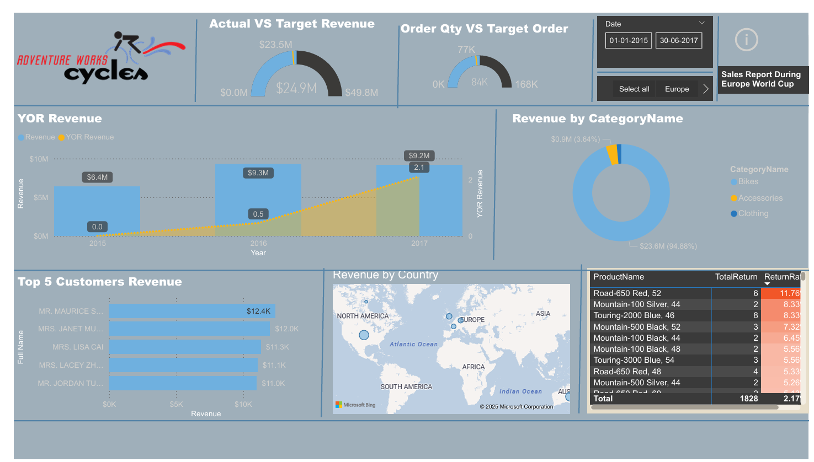
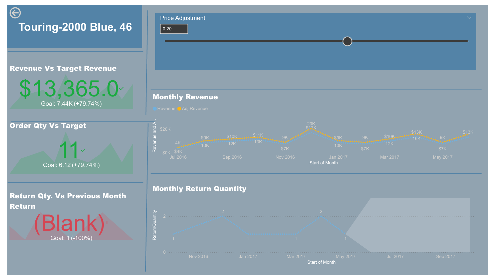
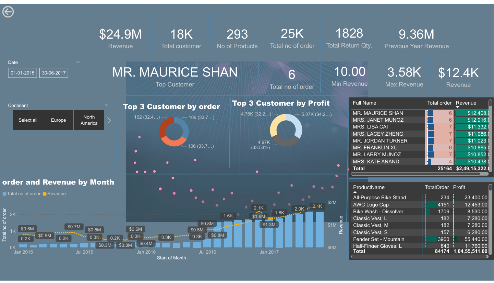

# 🚴 Adventure Works Sales Dashboard – Power BI  

## 📌 Problem Statement  
Adventure Works, a global manufacturing company, wanted to monitor its **sales performance** across different dimensions (time, geography, product categories, and customers).  
The goal of this dashboard is to help business leaders answer:  
- How much revenue are we generating compared to last year and target?  
- Which products and categories are driving the most sales?  
- Who are the top customers contributing to revenue?  
- What is the return rate and which products are being returned most often?  
- How are orders and revenue trending over time?  

This helps the company in **tracking KPIs, identifying growth opportunities, and reducing product returns**.  

---

## 📂 Data Overview  
- Dataset: **Adventure Works sales data (2015–2017)**  
- Total Orders: **25K+**  
- Revenue: **$24.9M**  
- Customers: **18K**  
- Products: **293**  

---

## 📊 Key Metrics Tracked  
- **Revenue:** $24.9M  
- **Year-over-Year (YoY) Revenue:** $9.3M in 2017 (+ growth vs. previous years)  
- **Total Customers:** 18K  
- **Total Orders:** 25K  
- **Total Return Quantity:** 1,828 (2.17% return rate)  
- **Top Customer:** Mr. Maurice Shan ($12.4K revenue)  
- **Best Product by Orders:** Fender Set – Mountain (3,960 orders)  
- **Best Product by Profit:** All-Purpose Bike Stand ($23,400 profit)  

---

## 📌 Dashboard Insights  
1. **Revenue Performance**  
   - Actual Revenue: **$23.5M** vs Target: **$24.9M**  
   - Revenue trend shows steady growth between 2015–2017  

2. **Category Analysis**  
   - **Bikes** contribute ~95% of total revenue  
   - Accessories & Clothing contribute the rest  

3. **Customer Analysis**  
   - Top 5 customers each contribute >$11K revenue  
   - High-value customers can be targeted for loyalty programs  

4. **Geographic Analysis**  
   - Revenue concentrated in **Europe & North America**  
   - Regional trends aligned with sporting events (e.g., World Cup in Europe)  

5. **Returns Analysis**  
   - Return rate: **2.17%** overall  
   - Specific products (e.g., Road-650 Red, Touring-2000 Blue) show higher-than-average return rates  

---

## 📈 Business Impact  
- 📊 **Informed Decision Making:** Management can monitor sales vs targets in real-time  
- 🛒 **Product Strategy:** Identify high-performing vs. high-return products to adjust production  
- 👥 **Customer Retention:** Recognize top customers and improve relationship strategies  
- 🌍 **Regional Focus:** Allocate marketing budget to regions contributing highest sales  
- 📉 **Operational Efficiency:** Reduce returns by analyzing defective/high-return items  

---

## 🖼️ Dashboard Preview  

### Page 1 – Executive Overview  
  

### Page 2 – Sales Analysis  
  

### Page 3 – Returns & Customer Insights  
  

---

## ⚙️ Tech Stack  
- **Power BI Desktop** for data visualization  
- **SQL Server / CSV** as data source  
- **DAX** for calculated measures (YoY revenue, return rate, profit contribution, etc.)  

---

## 📁 Project Structure  
