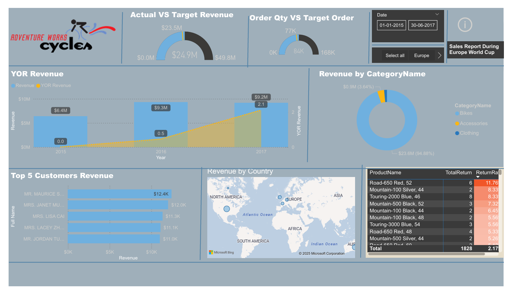
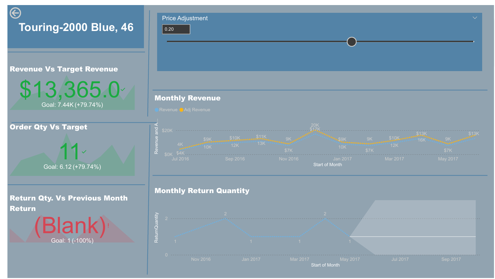
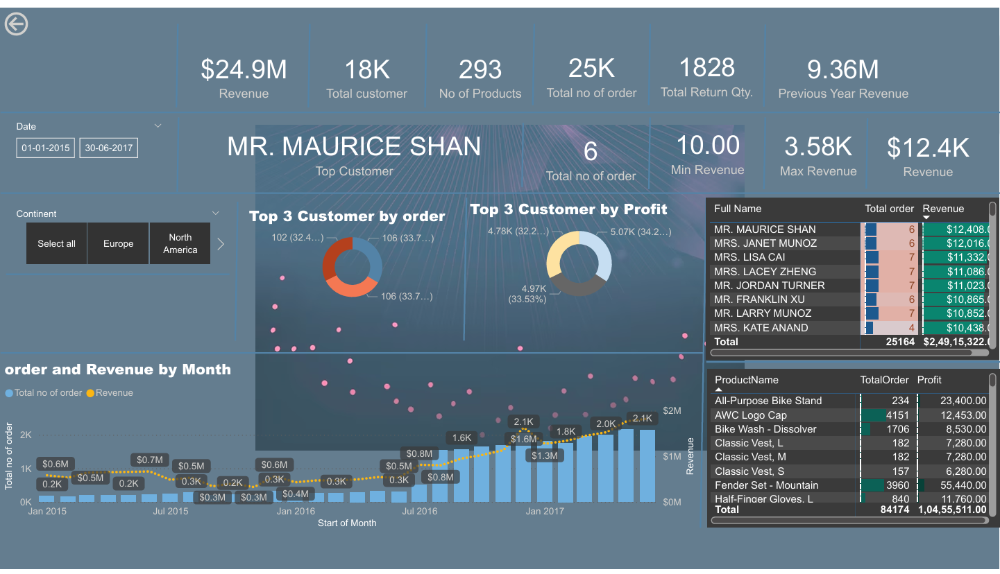

# Adventure Works Sales & Returns Dashboard — Power BI

## Business Objective

This Power BI project analyzes Adventure Works sales performance across time, geography, products, customers, and returns.

The dashboard is designed to help business users monitor revenue, orders, customer contribution, product performance, and return behavior.

## Business Questions

- How is revenue trending over time?
- How does current revenue compare with the available target/previous-period view?
- Which products and categories contribute most to sales?
- Which customers contribute the most revenue?
- What is the return rate and which products show higher returns?
- Which regions contribute most to overall revenue?

## Dataset

The repository contains Adventure Works data covering **2015–2017**, including:

- Calendar
- Customers
- Products
- Product categories and subcategories
- Returns
- Territories

The repository also includes the Power BI report and exported dashboard pages.

## Key Dashboard Metrics

The existing dashboard reports approximately:

- **25K+ orders**
- **18K customers**
- **293 products**
- **$24.9M revenue view**
- **1,828 returned units**
- **2.17% return rate**

The dashboard also includes product, customer, geographic, and year-over-year analysis.

## Analysis Areas

### Sales Performance

Revenue is analyzed across the 2015–2017 period with time-based comparisons and target-oriented KPI views.

### Product Performance

The dashboard compares product categories and individual products to identify major contributors to sales and products associated with returns.

### Customer Analysis

Customer-level revenue rankings highlight high-value customers and support customer-retention analysis.

### Geographic Analysis

Revenue is segmented by territory/region to identify the markets contributing most to sales.

### Returns

Return quantity and return rate are analyzed to identify products with comparatively higher return behavior.

## Power BI Capabilities Demonstrated

- Power BI Desktop
- Data preparation
- Data modeling
- DAX measures
- Time-based analysis
- KPI cards
- Product and customer ranking
- Geographic analysis
- Returns analysis
- Multi-page dashboard design

## Dashboard Preview

### Executive Overview

### Sales Analysis

### Returns & Customer Analysis

## Repository Files

- `AW-Report-file_custom.pbix` — Power BI report
- `AW-Report-file_custom.pdf` — exported dashboard
- Adventure Works CSV files — source data
- `p1.png`, `p2.png`, `p3.png` — dashboard previews
- `Adventure_Works_Cycles_Dashboard_Analysis.pptx` — supporting presentation

## Tech Stack

**Power BI Desktop | Power Query | DAX | Data Modeling | Sales Analytics**
