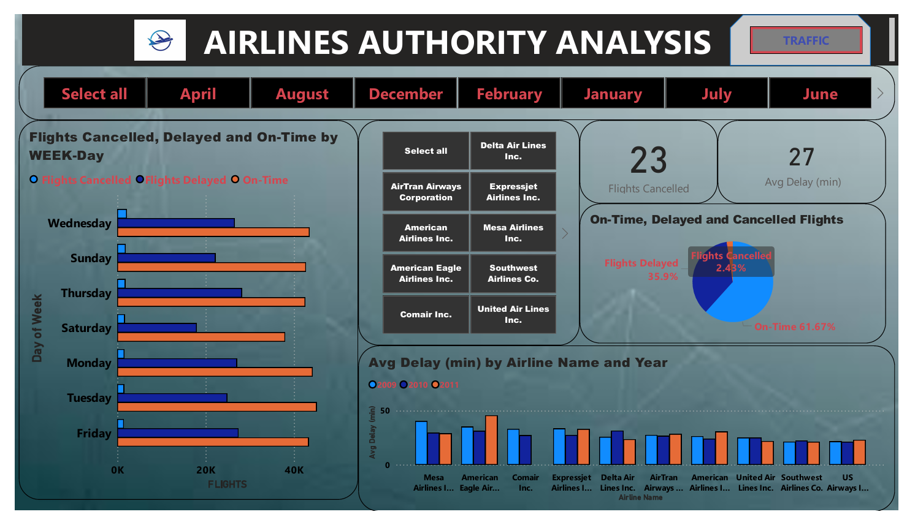
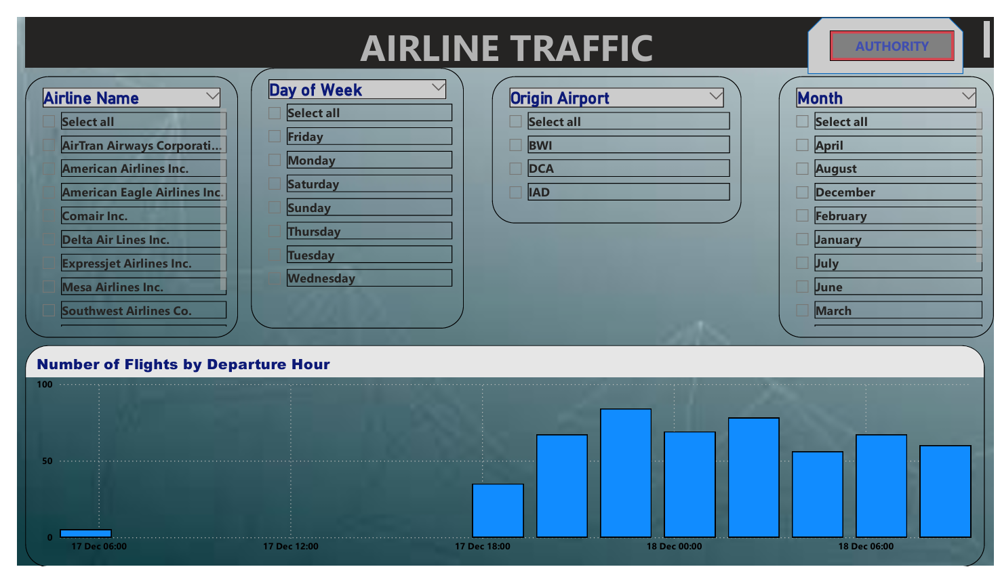

# ✈️ Flight Performance Analysis – Power BI  

## 📌 Problem Statement  
Flight delays and cancellations directly impact **customer satisfaction, airline reputation, and operational costs**.  
This dashboard was created to analyze flight operations, uncover trends in delays and cancellations, and provide actionable insights for **airlines and aviation authorities**.  

The dashboard helps answer:  
- What % of flights are On-Time, Delayed, or Cancelled?  
- Which airlines and routes experience the most delays?  
- What is the average delay time per airline?  
- Are delays concentrated on specific days of the week or months?  
- Which airports experience the most congestion?  

---

## 📂 Data Overview  
- Dataset: **US Airline Operations Data (2009–2011)**  
- Records include: Flight status (on-time, delayed, cancelled), Airline, Origin Airport, Day, Month, and Departure Hour  

---

## 📊 Key Metrics Tracked  
- **On-Time Flights:** 61.67%  
- **Delayed Flights:** 35.9%  
- **Cancelled Flights:** 2.43%  
- **Average Delay Time:** 27 minutes  
- **Worst Performing Airlines (Avg Delay):** Mesa Airlines, American Eagle, Comair  
- **Best Performing Airlines (On-Time %):** Southwest Airlines, Delta Air Lines  

---

## 📌 Dashboard Insights  

1. **Flight Punctuality**  
   - Over one-third of flights experienced delays  
   - Cancellation rate relatively low at 2.43%  

2. **Airline Performance**  
   - Mesa Airlines & American Eagle have consistently high delays  
   - Southwest Airlines performs best with minimal delays  

3. **Day & Month Trends**  
   - Delays peak on **Fridays & Sundays** (high traffic days)  
   - Certain months (December, August, July) show worse on-time performance due to weather & seasonal demand  

4. **Airport Analysis**  
   - Congestion higher at major hubs (IAD, DCA, BWI)  
   - Departure delays spike during **early morning and evening rush hours**  

---

## 📈 Business Impact  
- ✈️ **Operational Planning:** Helps airlines optimize crew and gate scheduling  
- 🛑 **Delay Reduction:** Identifies worst-performing airlines & routes to improve service  
- 👥 **Customer Experience:** Improves reliability insights for passengers  
- 🌍 **Authority Oversight:** Assists regulators in monitoring airline punctuality  

---

## 🖼️ Dashboard Preview  

### Page 1 – Flight Status (On-Time / Delayed / Cancelled)  
  

### Page 2 – Airline Traffic & Departure Hour Trends  
  

👉 *Click images for full view or check the PDF version:*  
📑 [View Full Dashboard PDF](FLIGHT_ANYALSIS.pdf)  

---

## ⚙️ Tech Stack  
- **Power BI Desktop** for dashboard creation  
- **DAX** for KPIs (Avg Delay, % On-Time, % Cancelled)  
- **CSV/SQL** flight data source  

---

## 📁 Project Structure  
