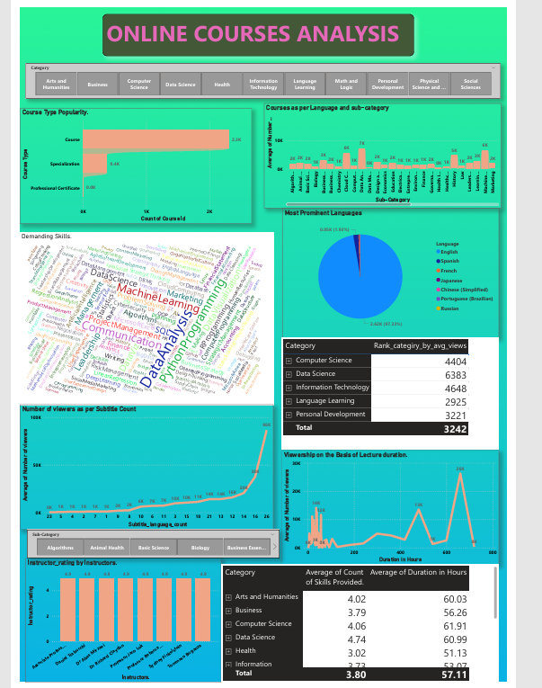

# 🎓 EdTech Recorded Lectures Analysis – Power BI  

## 📌 Problem Statement  
An **EdTech startup** aims to expand its offerings in **recorded lectures**. The company collected data from various EdTech platforms but needed analysis to uncover **category-wise insights** that would help improve content strategy, align with learner demand, and drive growth.  

This dashboard provides actionable insights into **course distribution, viewer engagement, language preferences, and instructor performance** to guide business decisions.  

---

## 📂 Data Overview  
- Dataset: EdTech course data (categories, sub-categories, languages, views, skills, ratings, instructors, subtitles, duration)  
- Size: ~20K+ records  
- Contains: Course ID, Title, Category, Sub-category, Language, Views, Ratings, Duration, Instructor, Skills, Subtitle Availability  

---

## 📊 Key Business Questions Answered  

1. **Course Distribution**  
   - Number of courses by **category** & **sub-category**  
   - Helps identify which domains are saturated vs. underrepresented  

2. **Viewer Engagement**  
   - Average **views** per category, sub-category, and language  
   - Strategic input for launching new courses  

3. **Skill Relevance**  
   - Top **skills** being taught within categories  
   - Ensures offerings align with **job market demand**  

4. **Language Analysis**  
   - Distribution of courses by **language**  
   - Language preference per top 5 categories (based on views)  

5. **Subtitle Impact**  
   - Relationship between **subtitle availability** and **views**  
   - Shows how accessibility features impact engagement  

6. **Instructor Insights**  
   - Top 3 instructors (by **rating**) for each category & sub-category  
   - Identifies top educators to collaborate with  

7. **Course Duration & Engagement**  
   - Relationship between **course length** and **views**  
   - Business rules:  
     - Fixed duration → 60 hrs/month  
     - Flexible schedules → 200 hrs  

8. **Skill Diversity & Viewership**  
   - Impact of **variety of skills** within a category on total views  

---

## 📈 Business Impact  
- 🎯 **Content Strategy:** Identify profitable categories & high-demand sub-categories  
- 🗣️ **Language Optimization:** Localize content based on learner demand  
- 📚 **Skill Alignment:** Focus on trending skills that match market demand  
- 👩‍🏫 **Instructor Partnerships:** Engage top instructors for premium courses  
- ♿ **Accessibility:** Subtitle analysis helps reach wider audiences  
- ⏱️ **Content Design:** Balance course length with learner engagement  

---

## 🖼️ Dashboard Preview  

### Page 1 – Analysis  
  

  

👉 *Click images for full size, or check the PDF version:*  
📑 [View Full Dashboard PDF](Edtec_Analysis.pdf)  

---

## ⚙️ Tech Stack  
- **Power BI Desktop** – Dashboard Creation  
- **DAX** – Measures for views, averages, instructor ranking  
- **Power Query** – Data cleaning & transformation  

---

## 📁 Project Structure  

