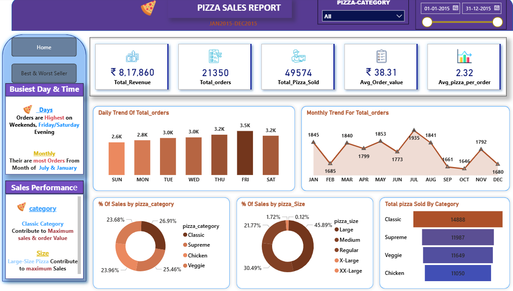
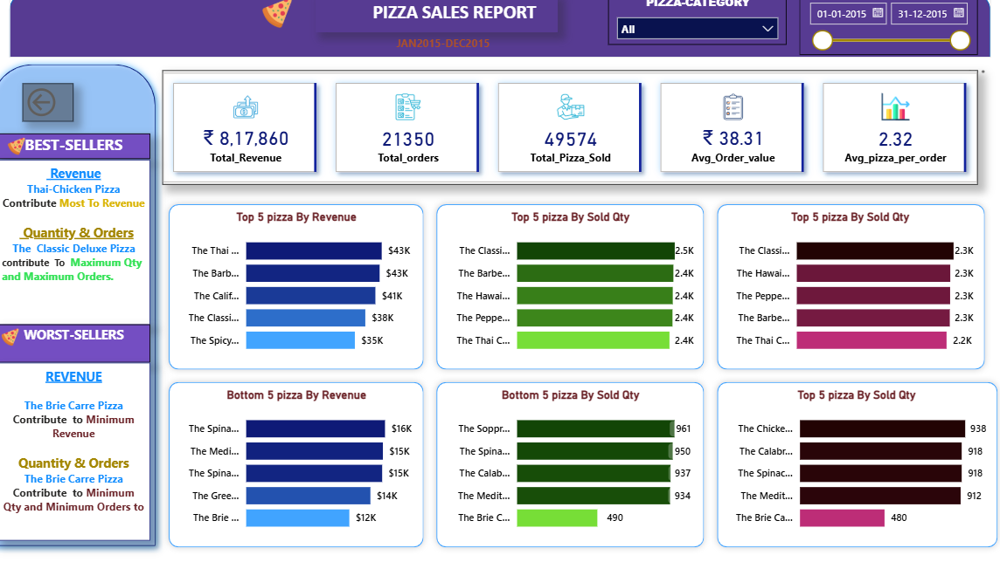

# 🍕 Pizza Sales Analysis (SQL + Power BI)  

## 📌 Project Overview  
This project combines **SQL queries** and **Power BI dashboards** to analyze one year of pizza sales data (Jan 2015 – Dec 2015).  

The analysis provides insights into **total revenue, customer ordering behavior, pizza category/size performance, and best & worst sellers**.  

The goal of the project is to demonstrate **end-to-end analytics**:  
- 📥 Data extraction & KPIs using **SQL**  
- 📊 Interactive visualization & storytelling using **Power BI**  

---

## 🚀 Key Features & Insights  

### 🔹 SQL Analysis  
SQL was used to query and aggregate data from the `pizza_sales` table.  

**KPIs Implemented:**  
- Total Revenue  
- Average Order Value  
- Total Pizzas Sold  
- Total Orders  
- Average Pizzas per Order  

**Trend Analysis:**  
- Daily trend of total orders  
- Monthly trend of total orders  

**Category & Size Contribution:**  
- % of Sales by Pizza Category  
- % of Sales by Pizza Size  

**Best & Worst Performers:**  
- Top 5 & Bottom 5 Pizzas by Revenue  
- Top 5 & Bottom 5 Pizzas by Quantity Sold  
- Top 5 & Bottom 5 Pizzas by Total Orders  

📌 Example Query – **Total Revenue**
```sql
SELECT SUM(total_price) AS Total_Revenue 
FROM pizza_sales;

## 🔹 Power BI Dashboard  

SQL outputs were visualized into **interactive dashboards** for storytelling.  

### 📌 KPIs Displayed  
- **Total Revenue** → ₹8,17,860  
- **Total Orders** → 21,350  
- **Total Pizzas Sold** → 49,574  
- **Average Order Value** → ₹38.31  
- **Avg Pizzas per Order** → 2.32  

### 📊 Visual Insights  
- 📈 **Daily & Monthly Trends** of orders.  
- 🥇 **Sales % by Pizza Category** → Classic (26.91%) is top.  
- 🍕 **Sales % by Pizza Size** → Large pizzas dominate (45.89%).  
- ✅ **Best Sellers**:  
  - Revenue → Thai Chicken Pizza  
  - Quantity & Orders → Classic Deluxe Pizza  
- ❌ **Worst Sellers**:  
  - Revenue → Brie Carre Pizza  
  - Quantity & Orders → Brie Carre Pizza  

📌 **Dashboard Preview**  


 

---

## 🛠️ Tools & Technologies  
- **SQL Server / MySQL** → Data extraction & queries  
- **Power BI Desktop** → Visualization & reporting  
- **DAX** → Additional calculations & KPIs  


SQL Server / MySQL → Data extraction & queries

Power BI Desktop → Visualization & reporting

DAX → Additional calculations & KPIs

