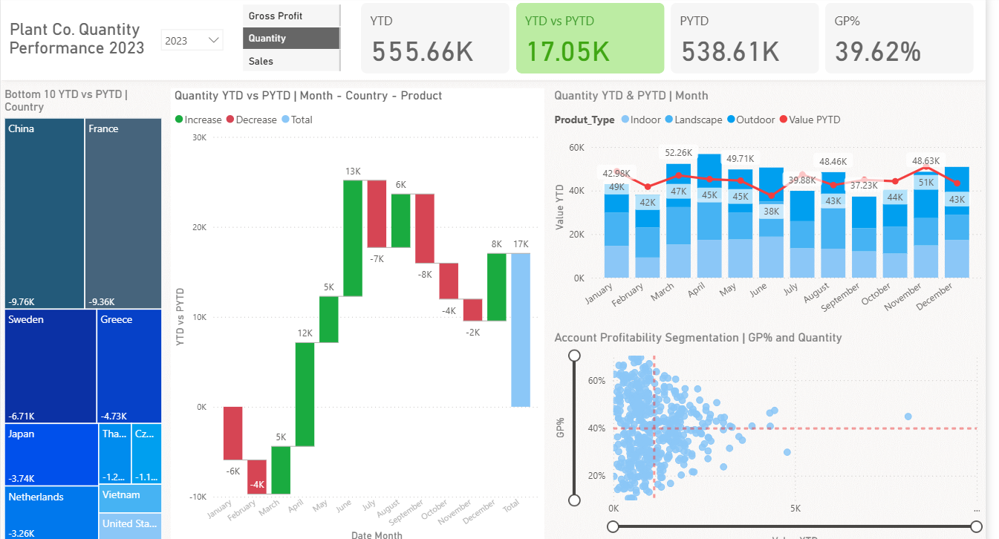

# 📊 Performance Report Dashboard  

## 📌 Project Overview  
This project presents a **Power BI dashboard** designed to evaluate business performance using **Year-to-Date (YTD) vs Previous Year-to-Date (PYTD)** metrics.  

The dashboard provides insights into **sales, gross profit, quantity performance, and country/product-level trends**, helping stakeholders track performance and make data-driven decisions.  

---

## 🚀 Features & Insights  

### 🔹 Key KPIs  
- **YTD Sales** → 555.66K  
- **PYTD Sales** → 538.61K  
- **YTD vs PYTD Difference** → +17.05K  
- **Gross Profit % (GP%)** → 39.62%  

### 📊 Visual Insights  
- **Bottom 10 Countries (YTD vs PYTD)** → Identifies underperforming regions (e.g., China, France, Sweden, Greece).  
- **Quantity Trend (YTD vs PYTD by Month, Country, Product)** → Highlights monthly increases and decreases in sales quantity.  
- **Quantity YTD & PYTD** → Monthly comparison to detect seasonality and performance gaps.  
- **Product Type Analysis** → Indoor, Landscape, Outdoor sales and profitability.  
- **Account Profitability Segmentation** → Gross Profit % vs Quantity to identify high-value customers/products.  

📌 **Dashboard Preview**  
  

---

## 🛠️ Tools & Technologies  
- **Power BI Desktop** → Data modeling & visualization  
- **Power Query** → Data cleaning & transformations  
- **DAX** → Custom KPIs (YTD, PYTD, GP%)  

---

  
