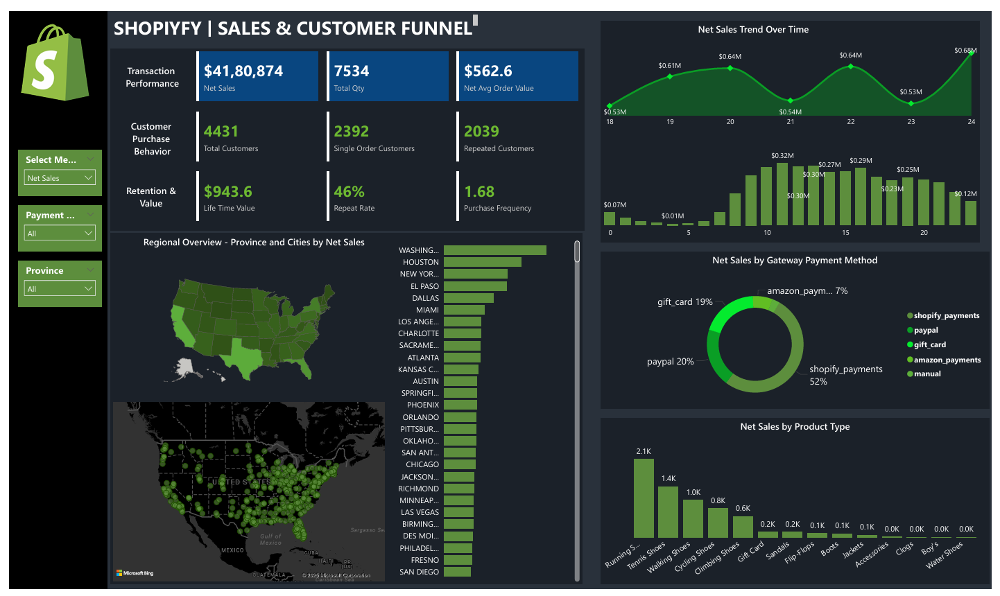
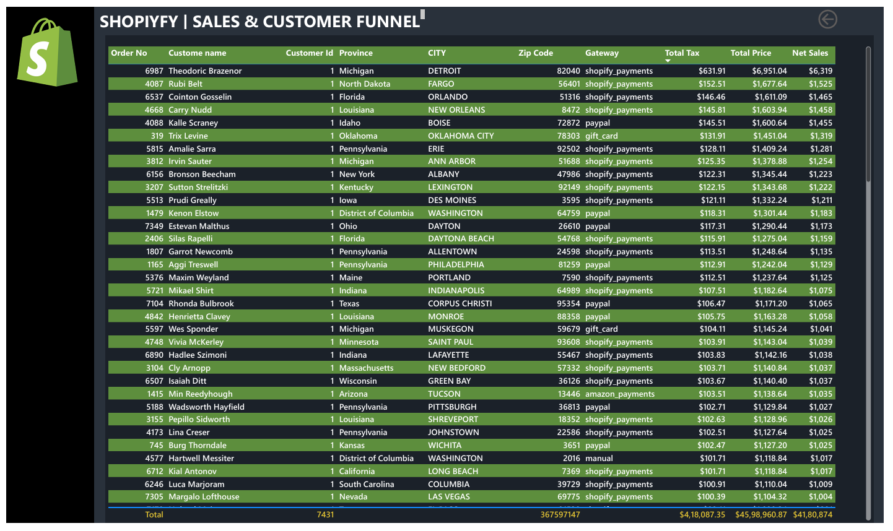

# 🛒 Shopify Sales & Customer Funnel Dashboard  

## 📊 Project Overview  
This project presents an **interactive Power BI dashboard** for analyzing Shopify sales, customer purchase behavior, and regional performance.  

The analysis is built on **one week of transactional data**, but the dashboard provides **pinpoint and detailed insights** using advanced Power BI features like **drill-throughs, bookmarks, custom tooltips, dynamic measures, and funnel analysis**.  

---

## 🚀 Features & Insights  

### 🔹 Key KPIs  
- **Net Sales** → $4.18M+  
- **Total Quantity Sold** → 7,534  
- **Average Order Value (AOV)** → $562.6  
- **Total Customers** → 4,431  
- **Repeat Customers** → 2,039 (46% repeat rate)  
- **Customer Lifetime Value (LTV)** → $943.6  
- **Purchase Frequency** → 1.68  

---

### 🔹 Customer Funnel Analysis  
- **Single vs Repeat Customers** → Funnel visualization of retention and repeat purchase patterns.  
- **Repeat Rate** and **Purchase Frequency** to measure loyalty.  
- **Customer Lifetime Value (LTV)** tracking for long-term profitability.  

---

### 🔹 Regional Sales Insights  
- **Province & City-Level Drill-Throughs** to pinpoint high-performing locations.  
- **Interactive Maps** showing sales distribution across the US.  
- **Trend Analysis** of daily net sales within the week.  

---

### 🔹 Product & Payment Insights  
- **Net Sales by Product Type** → Shoes, Apparel, Accessories, Gift Cards, etc.  
- **Payment Gateway Analysis** → Shopify Payments (52%), PayPal (20%), Gift Cards (19%), Amazon Pay (7%), Manual payments.  
- **Top Products** ranked by revenue and quantity sold.  

📌 **Dashboard Preview**  
  

📌 **Details Preview**  
  

---

## 🛠️ Advanced Power BI Features Used  
- **Drill-Through Navigation** (from product → region → customer details).  
- **Dynamic Measures & Titles** for context-driven KPIs.  
- **Custom Tooltips** with transaction-level details.  
- **Bookmarks** for funnel stages & customer behavior segmentation.  
- **Conditional Formatting** in sales tables.  
- **Customer-Level Drill-Down** for transaction history.  

---

## 📂 Repository Structure  
