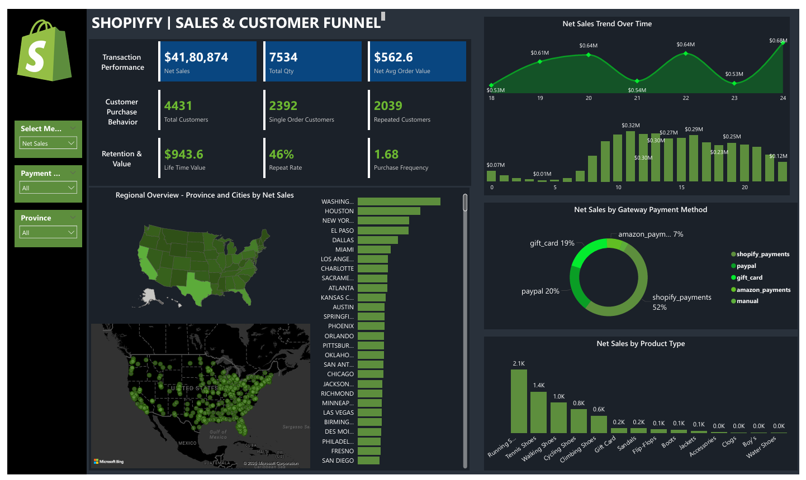
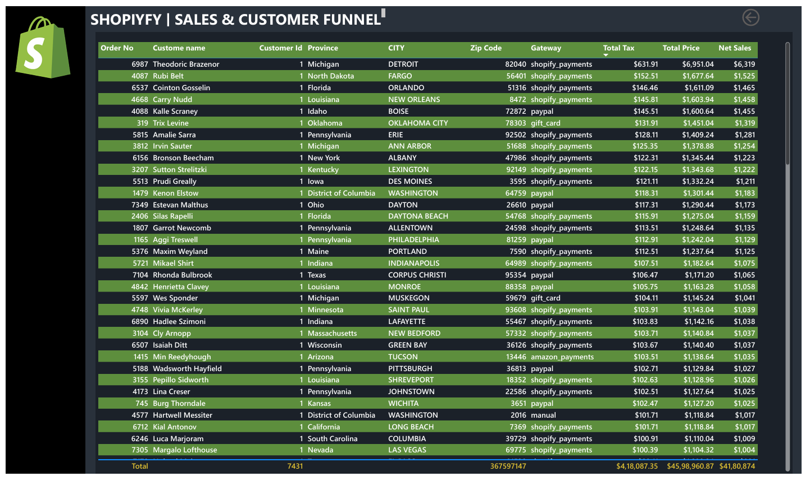

# Shopify Sales & Customer Funnel Dashboard — Power BI

## Business Objective

This dashboard analyzes Shopify transactional data to understand sales performance, customer purchasing behavior, regional performance, product mix, and payment-channel contribution.

Although the source dataset covers one week of transactions, the dashboard is designed around reusable business KPIs and interactive analysis rather than a simple collection of charts.

## Executive KPIs

The dashboard reports:

- **Net Sales:** $4.18M+
- **Total Quantity Sold:** 7,534
- **Average Order Value:** $562.6
- **Total Customers:** 4,431
- **Repeat Customers:** 2,039
- **Repeat Customer Rate:** 46%
- **Customer Lifetime Value:** $943.6
- **Purchase Frequency:** 1.68

## Business Questions

- How much revenue is being generated?
- What proportion of customers are repeat customers?
- Which products and product types drive sales?
- Which regions and cities perform best?
- How does payment method contribute to sales?
- What does customer purchase frequency indicate about retention?

## Dashboard Analysis

### Customer Funnel

The dashboard separates single-purchase and repeat-purchase behavior and tracks:

- Repeat customer rate
- Purchase frequency
- Customer lifetime value
- Customer-level purchase history

### Regional Performance

Interactive analysis supports:

- Province-level performance
- City-level drill-through
- Geographic sales distribution
- Daily sales trends

### Product & Payment Analysis

The dashboard analyzes sales by product type and payment gateway and ranks products by revenue and quantity.

Reported payment mix includes Shopify Payments, PayPal, Gift Cards, Amazon Pay, and manual payments.

## Power BI Features Demonstrated

- Power Query for data preparation
- Data modeling and measures
- DAX measures
- Dynamic measures and titles
- Drill-through pages
- Bookmarks
- Custom tooltips
- Conditional formatting
- Customer-level drill-down
- Interactive geographic analysis

## Dashboard Preview

## Important Limitation

The source data represents one week of transactions. Therefore, the customer and sales metrics should be interpreted as analysis of the supplied period rather than long-term business performance.

## Repository Files

- `Shofify Dashboard.pbix` — Power BI report
- `Shofify Dashboard.pdf` — exported dashboard
- `Shopify PPT.pptx` — supporting presentation
- `Shopify - Data Terminology.docx` — metric/data definitions
- `d1.png`, `d2.png` — dashboard previews

## Tech Stack

**Power BI Desktop | Power Query | DAX | Data Modeling | Interactive Dashboarding**
