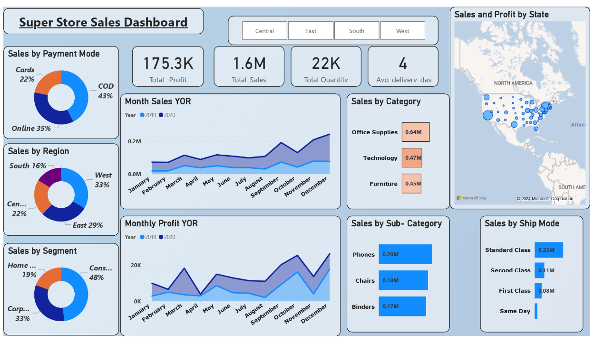
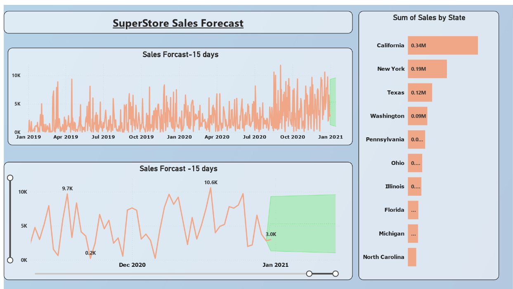

# 🏬 Super Store Sales Analysis – Power BI  

## 📌 Problem Statement  
Retail businesses face challenges in **tracking sales performance, customer behavior, and forecasting demand**.  
This dashboard was designed to help a retail store analyze **sales, profit, and order fulfillment trends** across different regions, categories, and customer segments.  

The key questions answered are:  
- What are the total sales, profit, and order quantity?  
- Which product categories and sub-categories drive the highest revenue?  
- How are sales distributed across states and regions?  
- Which customer segments and payment methods contribute the most?  
- What is the **sales forecast** for the next 15 days?  

---

## 📂 Data Overview  
- Dataset: **Superstore Sales Data (2019–2021)**  
- Contains: Orders, Sales, Profit, Quantity, Customer Segment, Category, State, Payment Mode, Delivery Days  

---

## 📊 Key Metrics  
- **Total Sales:** $1.6M  
- **Total Profit:** $175.3K  
- **Total Quantity Sold:** 22K  
- **Average Delivery Days:** 4  

---

## 📌 Dashboard Insights  

1. **Sales & Profit Overview**  
   - Technology & Office Supplies are top-performing categories  
   - Phones, Chairs, and Binders are the highest-selling sub-categories  

2. **Regional & State Performance**  
   - California leads with the highest sales, followed by New York & Texas  
   - East region contributes the largest share of sales (33%)  

3. **Customer Segmentation**  
   - Consumer segment generates the highest revenue (48%)  
   - Online payments dominate at 43%, followed by COD (35%)  

4. **Shipping Mode & Delivery**  
   - Standard Class is the most used shipping mode  
   - Average delivery time across orders is 4 days  

5. **Sales Trends & Forecasting**  
   - Steady growth observed across 2019–2020  
   - Forecast predicts ~15-day sales trend with peaks in early January  

---

## 📈 Business Impact  
- 📦 **Inventory Planning:** Identify high-demand categories & states for stock allocation  
- 💰 **Profit Optimization:** Focus on profitable segments & products  
- 🚚 **Logistics Efficiency:** Track delivery days & optimize shipping modes  
- 🎯 **Customer Insights:** Understand segment & payment preferences for better targeting  
- 🔮 **Forecasting:** Helps management plan for future demand  

---

## 🖼️ Dashboard Preview  

### Page 1 – Sales Overview  
  

### Page 2 – Sales Forecast (15 Days)  
  

👉 *Click images for full size, or check the PDF version:*  
📑 [View Full Dashboard PDF](Super%20Store%20sales.pdf)  

---

## ⚙️ Tech Stack  
- **Power BI Desktop** – Dashboard Creation  
- **DAX** – KPI Measures (Total Sales, Profit, Forecasting)  
- **Time Intelli**

