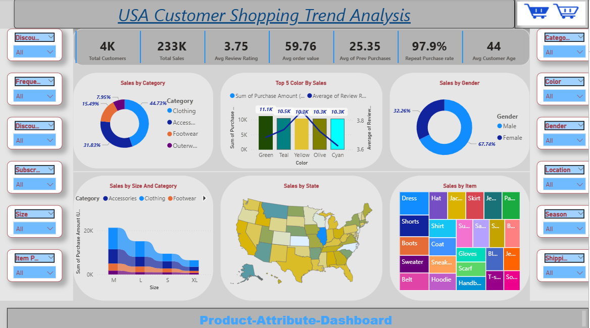
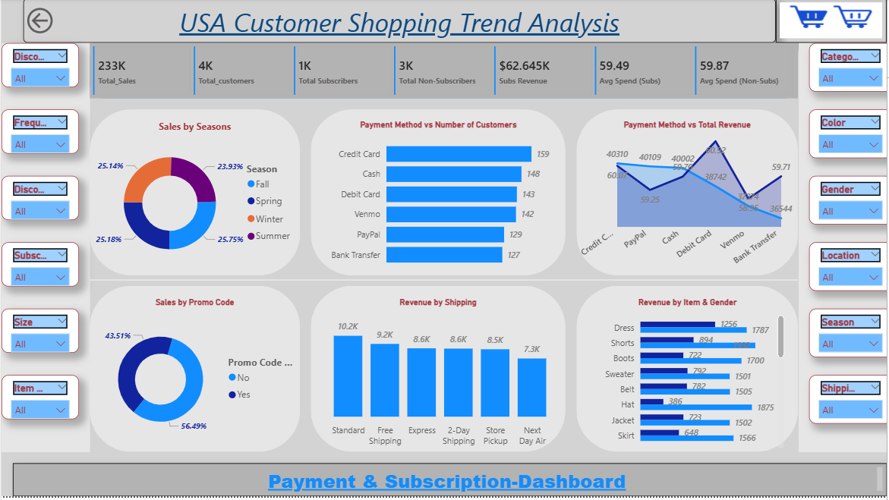

# 🛍️ USA Customer Shopping Trend Analysis  

## 📊 Project Overview  
This project presents an **interactive Power BI dashboard** analyzing customer shopping trends in the USA. The dashboard provides insights into **sales performance, customer behavior, product preferences, and payment/subscription patterns**.  

The goal of this project is to help businesses understand **who their customers are, what they buy, when they buy, and how they pay**, enabling data-driven decision-making.  

---

## 🚀 Features & Insights  

### 1. **Product Attribute Dashboard**  
- **Sales by Category**: Clothing, Accessories, Footwear, and Outerwear.  
- **Top 5 Colors by Sales**.  
- **Sales by Gender**: Male vs. Female contribution.  
- **Sales by State & Size-Category combination**.  
- **Sales by Individual Items** (Dress, Shorts, Boots, etc.).  
- **Customer KPIs**:  
  - Total Customers: **4K**  
  - Total Sales: **$233K**  
  - Average Review Rating: **3.75**  
  - Average Order Value: **$59.76**  
  - Repeat Purchase Rate: **97.9%**  
  - Average Customer Age: **44 years**  

📌 **Dashboard Preview**  
  

---

### 2. **Payment & Subscription Dashboard**  
- **Sales by Season**: Fall, Spring, Winter, Summer (almost evenly distributed).  
- **Payment Method Analysis** (Credit Card, PayPal, Cash, Venmo, Debit Card, Bank Transfer).  
- **Revenue by Shipping Method** (Standard, Express, Store Pickup, Next Day Air).  
- **Sales by Promo Code Usage** (Yes/No).  
- **Subscription Analysis**:  
  - Subscribers: **1K** | Non-Subscribers: **3K**  
  - Subscriber Revenue: **$62.6K**  
  - Avg Spend (Subs): **$59.49** | Avg Spend (Non-Subs): **$59.87**  

📌 **Dashboard Preview**  
  

---

## 🛠️ Tools & Technologies  
- **Power BI Desktop** → Dashboard Creation & Data Visualization  
- **Data Modeling** → Relationships & Measures  
- **DAX Functions** → For KPIs and Calculations  

---

  

