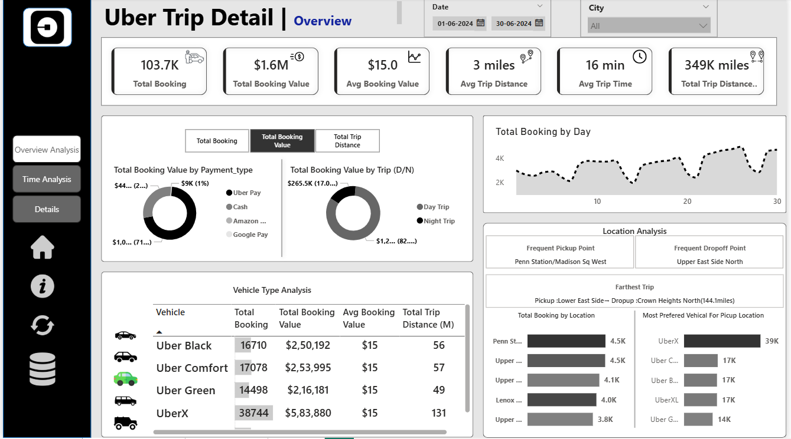
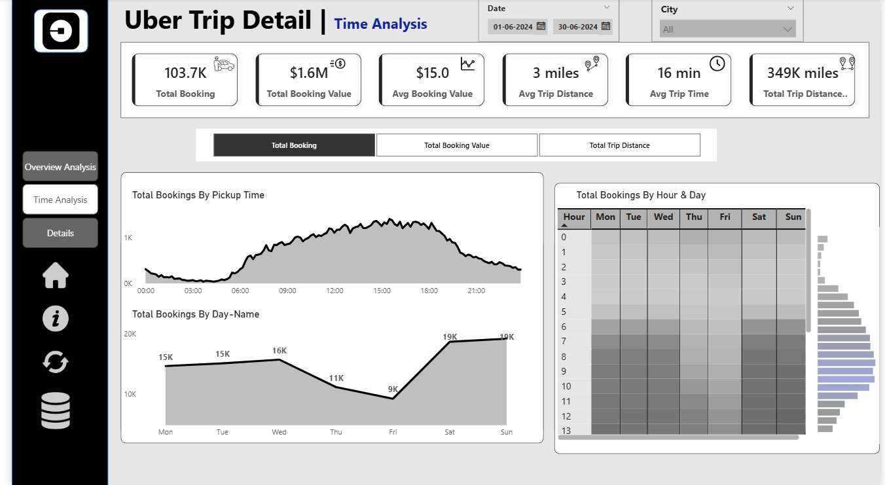
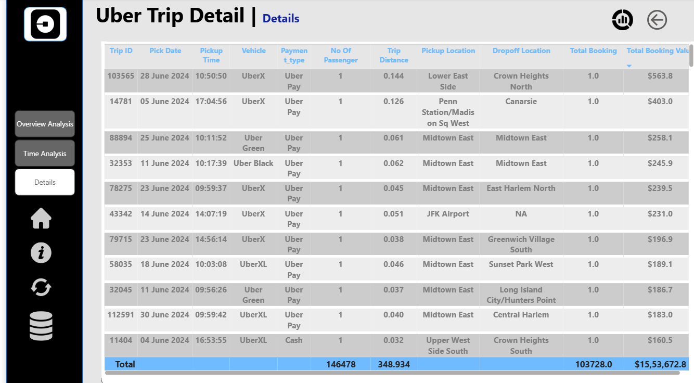

# 🚖 Uber Trip Analysis Dashboard  

## 📊 Project Overview  
This project presents an **interactive Power BI dashboard** analyzing Uber trip data to provide insights into **booking trends, revenue generation, trip efficiency, and location-based demand**.  

The dashboard is designed for stakeholders to make **data-driven decisions** related to pricing models, driver allocation, and operational efficiency.  

---

## 🚀 Features & Insights  

### 1. **Dashboard 1: Overview Analysis**  
- **KPIs**:  
  - Total Bookings  
  - Total Booking Value (Revenue)  
  - Average Booking Value  
  - Total & Average Trip Distance  
  - Average Trip Time  
- **Visualizations**:  
  - Bookings & Revenue by Payment Type  
  - Trip Type (Day/Night) Analysis  
  - Vehicle Type Performance with Conditional Formatting  
  - Daily Booking Trends  
- **Enhancements**:  
  - **Dynamic Measure Selector** (using disconnected tables)  
  - **Dynamic Titles** that change with user selections  
  - **Interactive Slicers** for city, date, and filters  
  - **Custom Tooltips** for deeper insights  

📌 **Dashboard Preview**  
  

---

### 2. **Dashboard 2: Time Analysis**  
- **Global Dynamic Measure** affecting all charts (Total Bookings, Revenue, Trip Distance).  
- **Visualizations**:  
  - **Pickup Time (10-Minute Interval) Analysis** → Peak & off-peak demand  
  - **Day of Week Trends** → Weekday vs Weekend demand  
  - **Heatmap (Hour vs Day)** → Identifying busiest hours across days  

📌 **Dashboard Preview**  
  

---

### 3. **Dashboard 3: Details Tab (Drill-Through)**  
- **Drill-Through Functionality**: Users can right-click on charts/heatmaps and drill into detailed trip records.  
- **Grid Table** with key trip fields (pickup, drop-off, distance, revenue, vehicle type, etc.).  
- **Bookmarks**:  
  - *View Full Data* → Toggle between drill-through results and full dataset.  
  - *Clear Filters* → One-click reset of slicers.  
- **Export Button**: Option to download raw trip data (CSV/Excel).  

📌 **Dashboard Preview**  
  

---

## 🛠️ Advanced Power BI Features Used  
- **Drill-Through Navigation** for detailed trip-level insights  
- **Bookmarks** for toggling between views and resetting filters  
- **Dynamic Titles** that adjust based on slicer selections  
- **Disconnected Tables** for dynamic measure selection  
- **Custom Tooltips** for contextual insights  
- **Conditional Formatting** to highlight KPIs  
- **Export to Excel/CSV Button** for raw data download  

---

## 📈 Key Outcomes  
- Identified **peak demand times & days** for better driver allocation.  
- Compared **revenue & efficiency across vehicle types**.  
- Found **top pickup & drop-off locations** for demand optimization.  
- Detected **longest trips and high-value bookings** for strategic planning.  

---

