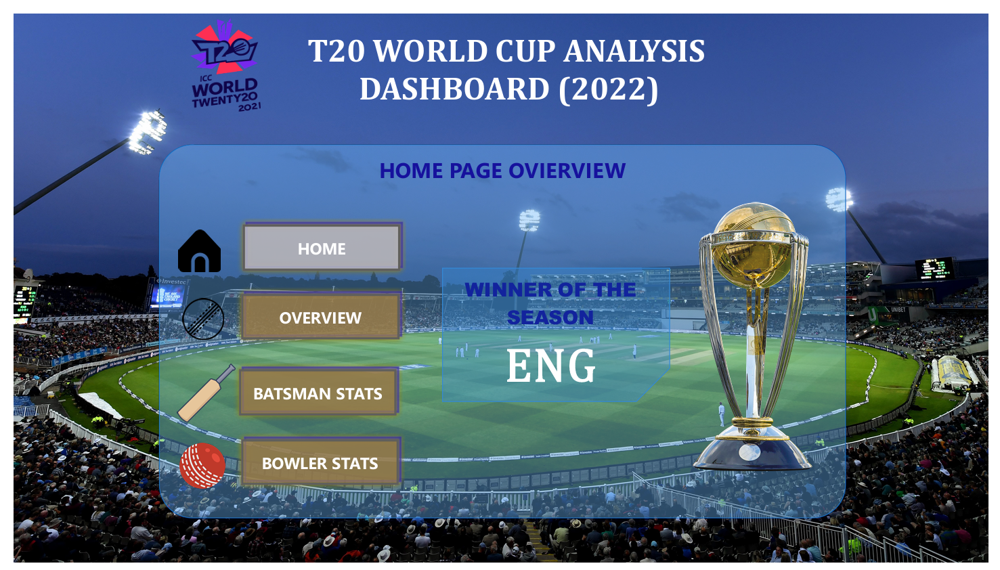
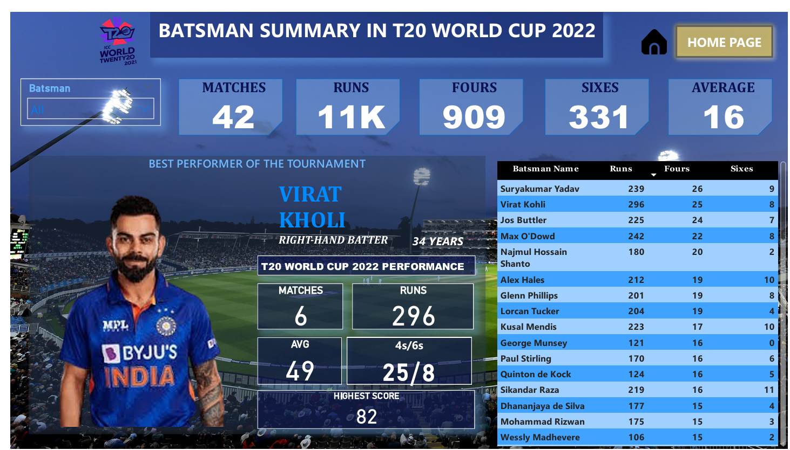
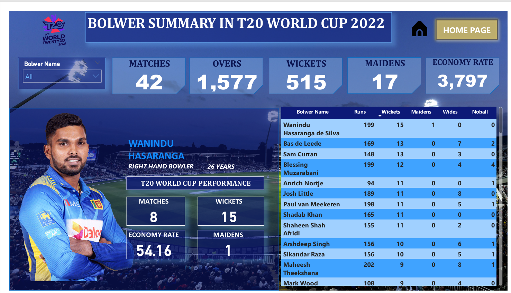

# 🏏 T20 World Cup 2022 Analysis – Power BI  

## 📌 Problem Statement  
Cricket boards, analysts, and fans require **in-depth insights** into match outcomes, team performances, and player stats.  
This dashboard was created to analyze the **T20 World Cup 2022** by providing interactive visualizations of matches, batting, and bowling performances.  

---

## 📂 Data Overview  
- Dataset: T20 World Cup 2022 match statistics  
- Contains: Teams, Toss Decisions, Match Results, Player Runs, Wickets, Economy, Stadiums  

---

## 📊 Key Metrics  
- **Total Matches:** 42  
- **Total Runs Scored:** 11K  
- **Total Fours:** 909  
- **Total Sixes:** 331  
- **Total Wickets:** 515  
- **Economy Rate:** 3,797  

---

## 📌 Dashboard Insights  

1. **Match Overview**  
   - England crowned champions 🏆  
   - Winning patterns by toss decision & stadium  

2. **Batting Analysis**  
   - Virat Kohli scored the highest runs (296)  
   - Suryakumar Yadav, Jos Buttler, and Alex Hales also among top run scorers  

3. **Bowling Analysis**  
   - Wanindu Hasaranga took the highest wickets (15)  
   - Sam Curran (13) and Anrich Nortje (11) were standout bowlers  

4. **Tournament Summary**  
   - Balance between batting first vs bowling first  
   - Stadium-wise outcomes & averages  

---

## 📈 Business / Sports Value  
- 🏏 Helps **selectors & analysts** identify best performers  
- 🎯 Useful for **strategic decision-making** (toss, batting/bowling order)  
- 📺 Engages **fans & broadcasters** with key stats and comparisons  

---

## 🖼️ Dashboard Preview 

### Page 1 –  Overview  
  

### Page 2 – Tournament Overview  
  

### Page 3 – Batting Stats  
  

### Page 4 – Bowling Stats  
  

👉 *Click images for full size, or check the PDF version:*  
📑 [View Full Dashboard PDF](T20%20World%20Cup%20Analysis%20Dashboard.pdf)  

---

## ⚙️ Tech Stack  
- **Power BI Desktop** – Dashboard creation  
- **DAX** – Custom KPIs for runs, wickets, averages  
- **Data Modeling** – Player stats, match outcomes  

---

