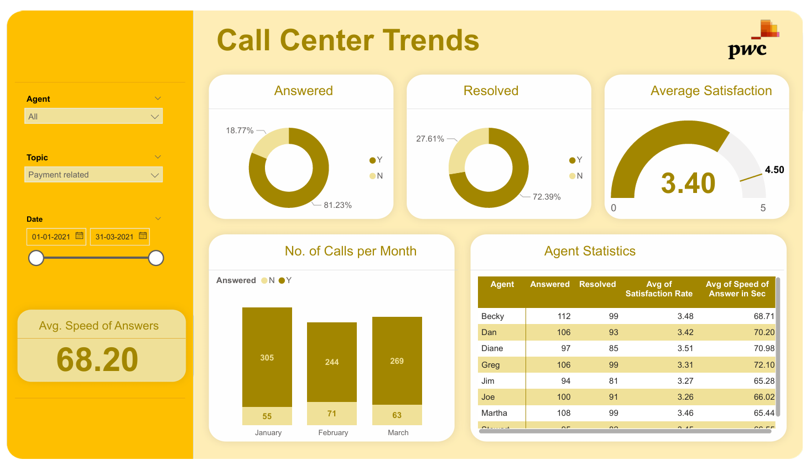

# 📞 Call Centre Trends – Power BI  

## 📌 Problem Statement  
Call centers are at the heart of **customer service operations**.  
Businesses need to track key metrics such as **response times, resolution rates, and customer satisfaction** to improve service quality.  

This dashboard was built to analyze call centre performance over a 3-month period (Jan–Mar 2021) and provide actionable insights.  

---

## 📂 Data Overview  
- Dataset: Call Centre Logs (Jan–Mar 2021)  
- Contains: Agent name, Calls Answered, Calls Resolved, Customer Satisfaction Score, Speed of Answer, Topic, and Date  

---

## 📊 Key Metrics  
- **Total Calls Answered:** 618  
- **Resolution Rate:** 81.23%  
- **Unresolved Calls:** 18.77%  
- **Average Customer Satisfaction Score:** 3.4 / 5  
- **Average Speed of Answer:** 68.2 seconds  

---

## 📌 Dashboard Insights  

1. **Call Volume Trends**  
   - January: 305 calls  
   - February: 244 calls  
   - March: 269 calls  
   - Overall: Call volumes peaked in January  

2. **Agent Performance**  
   - Greg achieved the highest satisfaction score (3.51) with strong resolution rate  
   - Diane and Becky also performed above average in satisfaction and resolution  
   - Stewart had the lowest satisfaction rating (3.00)  

3. **Resolution & Answer Rates**  
   - 81.23% of calls resolved successfully  
   - Average speed of answer ~68 seconds (goal <60s)  

4. **Customer Satisfaction**  
   - Average satisfaction ~3.4/5  
   - Indicates room for improvement in customer experience  

---

## 📈 Business Impact  
- 📞 **Improved Service Quality:** Identify top & low-performing agents  
- ⏱️ **Efficiency Tracking:** Monitor response speed and resolution  
- 🎯 **Training Needs:** Focus on agents with low satisfaction/resolution rates  
- 📊 **Management Reporting:** High-level KPIs to track service performance  

---

## 🖼️ Dashboard Preview  

### Page 1 – Call Centre Performance  
  

👉 *Click image for full size, or check the PDF version:*  
📑 [View Full Dashboard PDF](Call%20Centre%20Trends.pdf)  

---

## ⚙️ Tech Stack  
- **Power BI Desktop** – Dashboard creation  
- **DAX** – Custom measures for resolution rate, satisfaction average  
- **Time Series Analysis** – Monthly call volumes  

---

## 📁 Project Structure  

